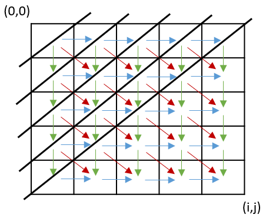

# Spatial-RNN-GRU or Multidimensional RNN/GRU

#### Note: This code is offered without any warranty and was develop as a way to better understand the tensorflow 2.0 framework. Finally any contributions are welcome

## TL; DR: What is currently implemented/working?
  * Spatial-GRU or 2D-GRU (kinda works, need more testing)


# Table of contents

<!--ts-->
   * [Table of contents](#table-of-contents)
   * [Introduction](#installation)
   * [How it works](#installation)
   * [Installation](#installation)
   * [Usage](#usage)
   * [Tests](#tests)
   * [Currently missing](#missing)
   * [Future improvements](#improvements)
<!--te-->


# Introduction

This repository aims to offer a multidimensional recurrent function, implemented in tensorflow 2.0 with Keras API, that can be used by multiple recurrent cells (RNN/GRU/LSTM).

As best of my knowledge this is the first publicly available repository that tries to implement this type of function in tensorflow 2. Futhermore, I was able to find ONLY one repository that tries to implement a [multidimensional-lstm](https://github.com/philipperemy/tensorflow-multi-dimensional-lstm) in tensorlflow 1.7.

It is worth to mention the [RetuRNN](https://github.com/rwth-i6/returnn) framework, which offers a (GPU-only) multidimensional LSTM.

Here some works that used/proposed this type of recurrency for "text" and "image" taks:

  * [Match-SRNN: Modeling the Recursive Matching Structure with Spatial RNN](https://arxiv.org/pdf/1604.04378.pdf)
  * [DeepRank: A New Deep Architecture for Relevance Ranking in Information Retrieval](https://arxiv.org/abs/1710.05649)
  * [Modeling Diverse Relevance Patterns in Ad-hoc Retrieval](https://arxiv.org/pdf/1805.05737.pdf)
  * [Multi-Dimensional Recurrent Neural Networks](https://arxiv.org/pdf/0705.2011.pdf)
  * [Handwriting Recognition with Large Multidimensional Long Short-Term MemoryRecurrent Neural Networks](https://www.vision.rwth-aachen.de/media/papers/MDLSTM_final.pdf)

# How it works

### In theory

A multidimensional RNN is similar to an one dimensional recurrent neural network, but instead of only using one state (the output of the previous step), it uses multiples states that corresponds to the previous computed outputs in each dimension.

The following image shows an example applied to two dimensional data, where each entry has acess to three previous states (left in blue, top in green and diagonal in red). In some works only the left and top states are used.


### In practice

The current implementation follows a naive approach that iterates sequentially over every 2D entry (first column dimension and then row), feeding the previous computed states (left, up, diagonal).

An (GPU/CPU) optimization could be achieved by computing oposed diagonals in parellel, since each entry in a oposed diagonal are independet as presentend in the follwing image by the black lines. However, note that their still exists an sequencial dependency between the black lines, in order for the privious states are all computed.



# Installation

git clone

# Usage

```python
# normal tensorflow keras imports
from tensorflow.keras import Sequential
from tensorflow.keras.layers import Dense
# multidimensional rnn imports
from mdrnn import MultiDimensionalRNN
from mdcells import MultiDimensinalGRUCell

gru_units = 4

model = Sequential()
model.add(MultiDimensionalRNN(MultiDimensinalGRUCell(gru_units), input_shape(5,5,1)))
model.add(Dense(4))

# normal keras model :D
```

# Tests

# Currently missing

# Future improvements

Contributions are welcome!!

* CPU/GPU improvement using the idea of oposed diagonal
* Multidirictional recurrency
